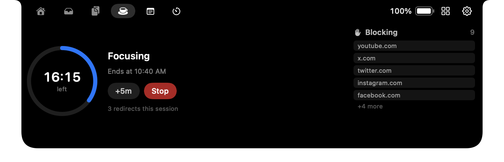
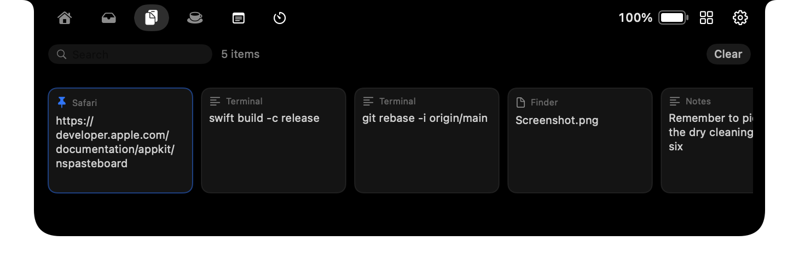
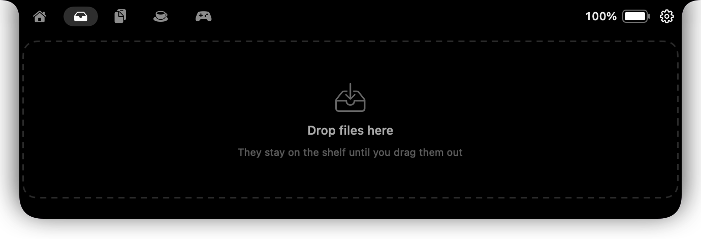
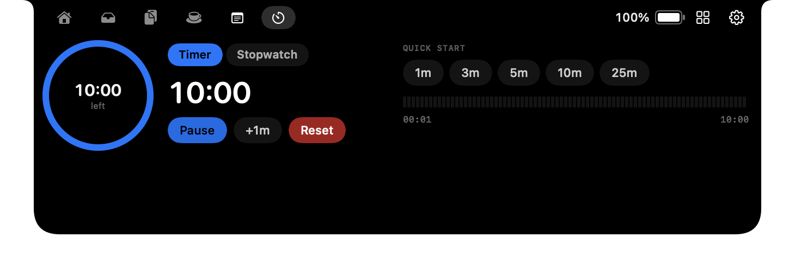
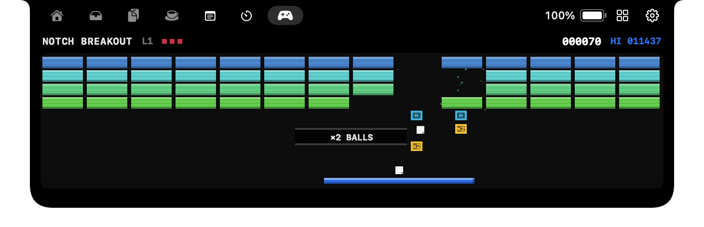

<div align="center">



# FunNotch

**Your MacBook notch, doing something.**

Media, a drag-and-drop file shelf, clipboard history, focus sessions, daily
notes, a timer and thirteen widgets — all in the space around the camera.

[](https://github.com/JoshuaT1105/FunNotch/releases/latest)
[](https://github.com/JoshuaT1105/FunNotch/releases)
[](https://github.com/JoshuaT1105/FunNotch/releases/latest)
[](https://github.com/JoshuaT1105/FunNotch/releases/latest)
[](LICENSE)

**[Download](https://github.com/JoshuaT1105/FunNotch/releases/latest/download/FunNotch.dmg)**
 · [funnotch.xyz](https://funnotch.xyz)
 · [Install guide](https://funnotch.xyz/install)
 · [Changelog](https://github.com/JoshuaT1105/FunNotch/releases)

Free and open source. No account, no subscription, no telemetry.

</div>

---

## What it does

- **Home** — a grid you compose yourself. Drag widgets in, resize them, and save
  layouts. Give a case its own screen: one for when media is playing, one for
  the minutes before a meeting, one for a focus session, one for charging.
- **Weather** — when nothing is playing, the panel shows the forecast as an
  animated pixel scene that changes with the weather: sun, rain onto a skyline,
  drifting snow, lightning.
- **Media** — now playing from Music, Spotify and any browser, with artwork, a
  live spectrum, and a progress bar you can drag to seek.
- **Shelf** — a drag-and-drop file shelf that opens to meet a drag already in
  flight. AirDrop and share straight off it; catches new screenshots and
  finished downloads on its own.
- **Clipboard** — searchable history with pinning, and entries that expire after
  24 hours by default. Anything a password manager marks concealed is skipped
  and never recorded.
- **Focus** — sessions that block websites and apps, with Pomodoro cycles.
- **Notes** — a scratchpad that starts a new note each day and saves to your
  Desktop, with the old ones a menu away.
- **Timer** — countdowns and a stopwatch with laps.
- **Battery** — charge level, and while charging the actual wattage, with the
  meter coloured and animated by state.
- **Widgets** — thirteen of them, any number either side of the camera.
- **HUD** — volume, brightness and keyboard backlight that *replaces* the
  system overlay rather than sitting beside it.
- **No notch? Still works.** On an external display it draws a floating pill in
  the same place, like the Dynamic Island.
- **And** — camera mirror, calendar and reminders, meeting-link detection,
  custom themes, automatic updates, a diagnostics screen, and a small game.

<table>
<tr>
<td width="50%"><br><sub><b>Clipboard</b> — searchable, pinnable, and labelled with where each entry came from.</sub></td>
<td width="50%"><br><sub><b>Shelf</b> — drop a file on the notch and it is held until you drag it out.</sub></td>
</tr>
<tr>
<td width="50%"><br><sub><b>Timer</b> — countdowns and a stopwatch with laps.</sub></td>
<td width="50%"><br><sub><b>And a game</b>, because the space was there.</sub></td>
</tr>
</table>

## Install

Download the
**[latest .dmg](https://github.com/JoshuaT1105/FunNotch/releases/latest/download/FunNotch.dmg)**,
drag FunNotch to Applications, and open it.

> **First launch.** Builds are signed ad-hoc rather than with a paid Apple
> Developer certificate, so macOS will refuse the first open. Go to
> **System Settings → Privacy & Security** and click **Open Anyway**, or
> right-click the app in Applications and choose **Open**. After that it opens
> normally, and updates arrive in-app.

Full walkthrough: [funnotch.xyz/install](https://funnotch.xyz/install).

## Building

No Xcode project — the app builds with `swiftc` directly.

```bash
./build.sh                       # debug build into build/
./build.sh --universal           # arm64 + x86_64
./build.sh --universal --package # ...and produce dist/*.dmg and dist/*.zip
```

Requires the Xcode command line tools. Everything under `build/` and `dist/` is
generated and git-ignored.

### Signing

Builds are **signed ad-hoc** by default, which is why macOS refuses the first
launch. If you have a paid Apple Developer certificate:

```bash
./build.sh --universal --package \
  --sign "Developer ID Application: Your Name (TEAMID)" \
  --notarize your-notary-profile
```

## Verifying a change

There is a self-test that drives the real window manager rather than mocking it
— it opens and closes the notch, simulates drags, and checks the panel geometry.

```bash
build/FunNotch.app/Contents/MacOS/FunNotch --self-test
```

It needs a GUI session, so it will not run over plain SSH. There is also a
preview renderer that writes every notch state to PNG, which is how the
screenshots in this README are produced:

```bash
build/FunNotch.app/Contents/MacOS/FunNotch --render-preview /tmp/shots
```

And a diagnostics dump:

```bash
build/FunNotch.app/Contents/MacOS/FunNotch --diagnostics
```

## Layout

```
Sources/
  App/          Lifecycle, status bar, self-test, preview renderer
  Core/         Settings, home-screen layout model, extensions, diagnostic log
  Managers/     Media, shelf, clipboard, focus, notes, timer, calendar,
                battery, weather, HUD, updates
  Settings/     The settings window and the home-screen editor
  Views/        The notch panel and everything drawn in it
Tools/
  MakeIcon.swift    Generates the app icon at build time
  fetch-sparkle.sh  Pins and verifies the Sparkle framework
  make-appcast.sh   Signs a release for the auto-updater
```

The marketing site at [funnotch.xyz](https://funnotch.xyz) is deliberately not
in this repo — it isn't part of the app, and it deploys separately.

## Permissions it asks for

None are required; each one only enables the feature that needs it.

| Permission | Used for |
|---|---|
| Accessibility | The HUD — catching the media key before macOS acts on it |
| Calendar & Reminders | The agenda beside the player |
| Camera | The camera mirror, only while open |
| Location | The weather scene, to pick a forecast |

The app makes network requests in exactly three situations: `api.open-meteo.com`
for the weather, album artwork from whatever URL your media source provides, and
a GitHub check for updates. There is no analytics, no crash reporting and no
telemetry of any kind. See [the About page](https://funnotch.xyz/about).

## Contributing

Issues and pull requests are welcome. A few things worth knowing:

- **Match the surrounding code.** Comments here explain *why*, not *what* —
  if a line needs a comment saying what it does, the line is usually the problem.
- **Run `--self-test` before opening a PR.** If you change window geometry,
  drag handling or the HUD, add a check to `Sources/App/SelfTest.swift`.
- **The notch is a non-activating panel.** It never becomes the key window, so
  keyboard events go to whatever app is actually in front. Anything interactive
  up there has to work from pointer position alone.
- **Managers are singletons with a `start()`.** Make `start()` idempotent — a
  view calling it on every `onAppear` should not stack timers or run-loop
  sources. That bug once locked the whole app.

## Prior art

FunNotch began as a rebuild of
**[TheBoringNotch](https://github.com/TheBoredTeam/boring.notch)**, which got to
the idea first and is a genuinely good app. There is an
[honest comparison](https://funnotch.xyz/#compare) on the website, including the
things theirs does better.

## Licence

[GPL-3.0](LICENSE). If you distribute a modified version, it has to be open
too.
